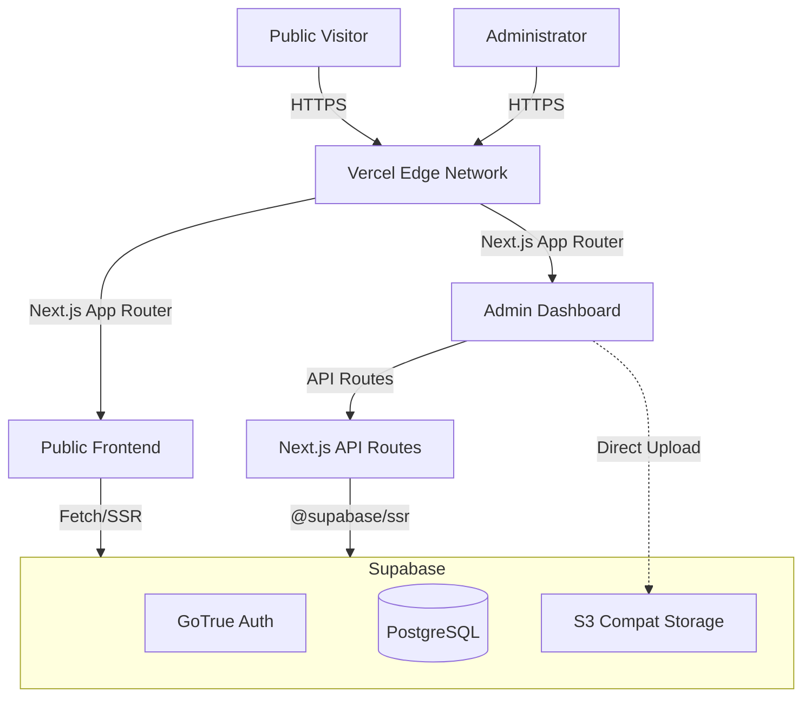
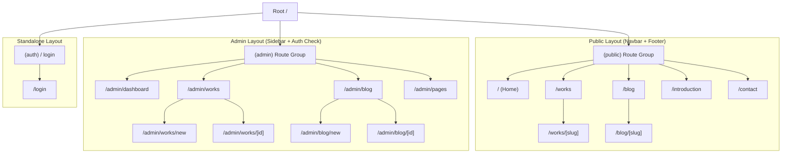
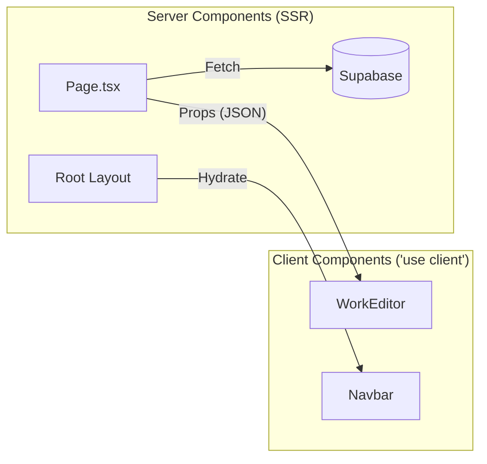

# System Architecture Analysis: JOHN_PORTFOLIO_V2

## 1. High-Level Overview

The system is a modern web application built on **Next.js 16 (App Router)**, integrating with **Supabase** for Backend-as-a-Service (BaaS) capabilities (Auth, Database, Storage). It features a distinct separation between the highly interactive **Admin Dashboard** and the performance-optimized **Public Portfolio**.



## 2. Frontend Architecture

### Core Stack
*   **Framework:** Next.js 16.1.6 (Turbopack)
*   **Language:** TypeScript 5
*   **Styling:** Tailwind CSS v4 + `shadcn/ui` (Radix UI primitives)
*   **State Management:**
    *   Server: React Server Components (RSC) + `@tanstack/react-query`
    *   Client: `zustand` (minimal usage) + React Hooks

### Component Structure (`src/components`)
*   **`layout/`**: Global shells (Navbar, Footer, Sidebar).
*   **`admin/`**: Complex "Smart" components for content management (e.g., `TiptapEditor`, `PageEditor`, `WorkEditor`). containing significant client-side logic.
*   **`ui/`**: Reusable "Dumb" primitives (Button, Input, Dialog) based on `shadcn/ui`.
*   **`content/`**: Renderers for dynamic content (e.g., `InteractiveRenderer` for safely parsing HTML/React).

## 3. App Router & Navigation

The application leverages Next.js 15+ **App Router** with **Route Groups** to separate public and admin layouts logically without affecting the URL structure.

### High-Level Routing Map



### Key Routing Patterns

1.  **Route Groups (`(public)`):**
    *   Files inside `src/app/(public)` (like `page.tsx`, `works/page.tsx`) share the `src/app/(public)/layout.tsx`.
    *   This layout includes the **Navbar** and **Footer**, consistently branding the public-facing site.
    *   The `(public)` folder name is omitted from the URL path.

2.  **Admin Area (`src/app/admin`):**
    *   Protected by `src/app/admin/layout.tsx`, which performs a server-side check for `profile.role === 'admin'`.
    *   Includes a **Sidebar** navigation for managing content.
    *   Uses **[id]** dynamic segments (e.g., `/admin/works/[id]`) for editing existing records, while `/new` routes handle creation.

3.  **Dynamic Routes (`[slug]` vs `[id]`):**
    *   **Public:** Uses SEO-friendly `[slug]` (e.g., `/works/my-project-title`) for cleaner URLs.
    *   **Admin:** Uses UUID `[id]` (e.g., `/admin/works/123e456...`) for precise resource identification and editing stability.

4.  **Navigation Implementation:**
    *   **Link Component:** Used for internal navigation (`next/link`) to enable client-side routing (prefetching, no hard reload).
    *   **Redirects:** Server-side redirects (`next/navigation`) are used for auth guards (e.g., redirecting unauthenticated users from `/admin` to `/login`).

The application uses Next.js Route Handlers as a backend layer, largely to act as a secure proxy or orchestrator for administrative actions.

*   `/api/admin/*`: CRUD endpoints for Pages. Explicitly protected by Admin Layout? No, protection is likely inside the handlers or via RLS if using the user token directly. *Analysis: Code view confirms `AdminLayout` protects the UI, but API routes must verify `is_admin` independently.*
*   `/api/ai/*`: Endpoints for AI features (Enrich Work, Fix Blog).
*   `/api/auth/*`: Auth callback handlers.
*   `/api/uploads`: Handling file uploads (though signed URLs are preferred for clients).

### Security & Authorization
*   **Authentication:** Supabase Auth (Google OAuth).
*   **UI Protection:** `src/app/admin/layout.tsx` enforces strict server-side checks:
    ```typescript
    const { data: { user } } = await supabase.auth.getUser()
    const { data: profile } = await supabase.from('profiles')...single()
    if (profile?.role !== 'admin') redirect('/')
    ```
*   **Row Level Security (RLS):** The ultimate security layer in Postgres.
    *   **Public:** Read-only access to `published` works/blogs.
    *   **Admin:** Full access to all tables via `is_admin()` policy function.

## 4. Rendering Strategy (SSR vs. CSR)

The application utilizes the **Hybrid Rendering** model of Next.js App Router, leveraging React Server Components (RSC) by default and opting into Client Side Rendering (CSR) only when interactivity is required.

### Server-Side Rendering (SSR / RSC)
**Default Behavior:** All pages and layouts are Server Components unless marked otherwise.
*   **Public Pages:** (`/`, `/introduction`, `/works`, `/blog`) are primarily SSR. They fetch data from Supabase on the server and render HTML for optimal Performance and SEO.
    *   *Example:* `src/app/(public)/page.tsx` fetches `site_settings` and `featured_works` directly on the server before sending HTML to the browser.
*   **Admin Shells:** Admin layouts and page roots (`src/app/admin/pages/page.tsx`) are SSR. They perform server-side authentication checks and initial data fetching before passing data to client components.
*   **SEO Metadata:** All `generateMetadata` functions run on the server.

### Client-Side Rendering (CSR)
**Interactive Islands:** Components explicitly marked with `"use client"` take over rendering in the browser to handle user interaction, state, and browser APIs.
*   **Admin Editors:** The core of the admin experience is highly interactive.
    *   `HomePageEditor.tsx`, `WorkEditor.tsx`, `PageEditor.tsx`: transform server data into editable forms.
    *   `TiptapEditor.tsx`: A rich text editor wrapper that relies entirely on client-side DOM APIs.
*   **Interactive UI:**
    *   `Navbar.tsx`: Handles mobile menu toggling state.
    *   `InteractiveRenderer.tsx`: Hydrates HTML strings with React components on the client.
    *   `ThemeToggle.tsx` & `Toast` notifications: Require access to `window`/`localStorage`.

### Data Flow Pattern
1.  **Server:** Fetches initial data (e.g., `works`, `profile`).
2.  **Boundary:** Passes data as **props** (serialized JSON) to Client Components.
3.  **Client:** Hydrates the component. User interactions (e.g., clicking "Save") trigger Server Actions or API calls to mutate data.



The database schema is normalized and leverages Postgres features like UUIDs, Arrays, and JSONB.

| Table | Purpose | Key Policies (RLS) |
| :--- | :--- | :--- |
| `profiles` | User metadata & Roles (`admin`/`user`) | Users read own; Admins read/write all. |
| `assets` | Metadata for uploaded files | Public read; Admin write. |
| `site_settings` | Global configs (URLs, owner info) | Public read; Admin write. Singleton enforced. |
| `pages` | Static content (Home, Intro) | Public read; Admin write. |
| `works` | Portfolio case studies | Public read `published=true`; Admin read/write all. |
| `blogs` | Blog posts | Public read `published=true`; Admin read/write all. |
| `page_views` | Analytics | Public insert (anon); Admin read. |

## 5. CI/CD Pipeline

### Workflow (`.github/workflows/ci-cd.yml`)
The project uses GitHub Actions to ensure code quality and automate deployment.

1.  **Job 1: `docker-ci` (Build Check)**
    *   **Trigger:** Push/PR to `main`.
    *   **Action:** Builds the Docker image from `Dockerfile`.
    *   **Purpose:** Ensures the application compiles and builds correctly in a containerized environment, catching build errors early.
    *   **Optimization:** Uses Docker Buildx with layer caching.

2.  **Job 2: `vercel-cd` (Deployment)**
    *   **Trigger:** Push to `main` (only if `docker-ci` passes).
    *   **Action:** Deploys to Vercel using `amondnet/vercel-action`.
    *   **Environment:** Pushes to Production (`--prod`).

## 6. Recommendations & Observations

1.  **API Security:** Ensure all API routes in `src/app/api/admin` explicitly check for `is_admin()` or use the Service Role key responsibly. relying solely on the UI's `AdminLayout` for protection is insufficient for API endpoints.
2.  **Middleware:** No `middleware.ts` is currently used. This is acceptable given the Layout-based protection, but adding middleware for closer-to-edge redirects could improve performance for unauthorized admin access attempts.
3.  **Type Safety:** Recent refactoring has significantly improved type safety (`any` removal), which is critical for the `jsonb` content fields in `pages`, `works`, and `blogs`.
